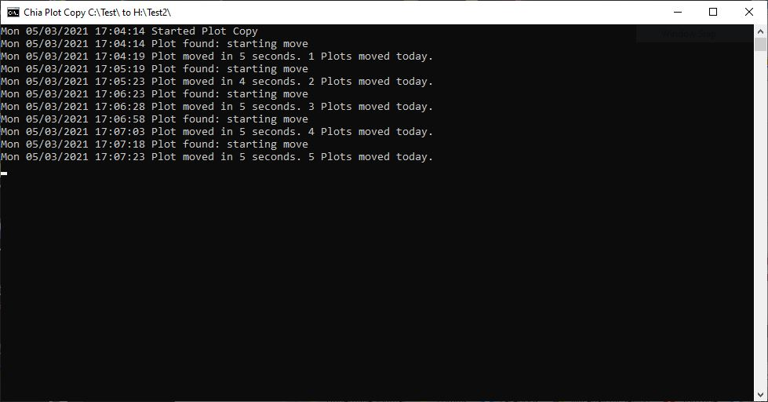

# Chia-Plot-Copy (windows only)
Copies Chia plots from the directory the batch file is started in to the configured destination.

To use Chia Plot Copy:

Save plotcopy.bat to the folder you are plotting into.  This could be the SSD you are using for temp or a staging SSD.

Right click the batch file and select edit.  On the sixth line down you will specify the destination you want to copy your plots to.  P:\Plots provided as an example - replace it with your destination.  Take note that spaces in the directory path are not supported.

Launch Chia Plot Copy.  Chia Plot Copy will now check the directory it is started from once per minute for a completed plot file and if found it will rename the plot file to a temporary file, move the file to the configured destination and remove .tmp from the end so that the harvester can pick it up.  The renaming is done to prevent the harvester from picking up on the plot while the copy is incomplete.

See also: https://github.com/cracklingice/Chia-Plot-Instance-Launcher

XCH: xch1aaryeda5ayqw56ue7zluavhj5dryda4pqzv0s9lnyandw4u0chxs6w74p9
DOGE: DD9nxzaaidMw4tQpZEvTNGCQ3NDdhpXYJJ
RVN: RHTVCcDpPvVawqgxPqxMEVUwBszR1AEMmX
